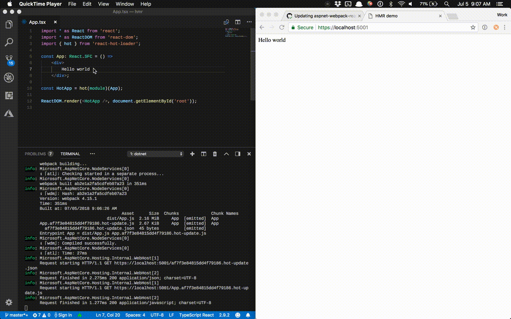

ASP.NET Core + Webpack + HMR Demo
=================================

A minimal demo showing how to configure:

 * Webpack 4
 * ASP.NET Core 2.1
 * React
 * Hot Module Replacement
 * TypeScript
 * Yarn

One of the primary benefits of configuring HMR is that you can quickly prototype changes to your client code without having to reload the browser or restart the web server.
ASP.NET Core's webpack middleware will automatically start a watcher
process to live-reload your changes.

